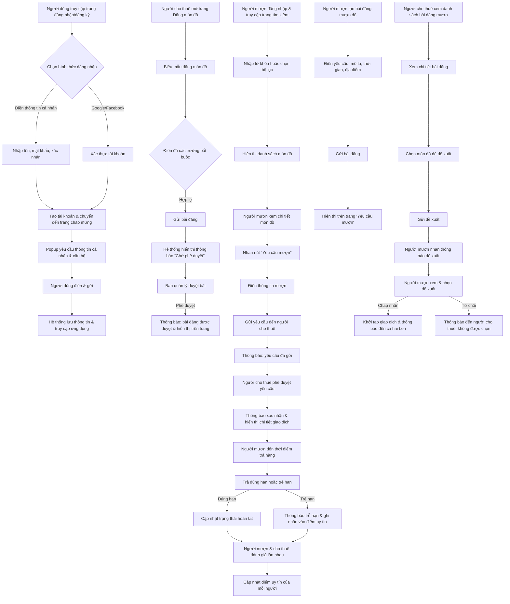

```mermaid
flowchart TD
  %% Đăng ký / Đăng nhập
  A[Người dùng truy cập trang đăng nhập/đăng ký] --> B{Chọn hình thức đăng nhập}
  B -->|Điền thông tin cá nhân| C[Nhập tên, mật khẩu, xác nhận]
  B -->|Google/Facebook| D[Xác thực tài khoản]

  C --> E[Tạo tài khoản & chuyển đến trang chào mừng]
  D --> E

  E --> F[Popup yêu cầu thông tin cá nhân & căn hộ]
  F --> G[Người dùng điền & gửi]
  G --> H[Hệ thống lưu thông tin & truy cập ứng dụng]

  %% Người thuê đăng món đồ
  I[Người cho thuê mở trang Đăng món đồ] --> J[Biểu mẫu đăng món đồ]
  J --> K{Điền đủ các trường bắt buộc}
  K -->|Hợp lệ| L[Gửi bài đăng]
  L --> M[Hệ thống hiển thị thông báo “Chờ phê duyệt”]
  M --> N[Ban quản lý duyệt bài]
  N -->|Phê duyệt| O[Thông báo: bài đăng được duyệt & hiển thị trên trang]

  %% Người mượn tìm & mượn món đồ
  P[Người mượn đăng nhập & truy cập trang tìm kiếm] --> Q[Nhập từ khóa hoặc chọn bộ lọc]
  Q --> R[Hiển thị danh sách món đồ]
  R --> S[Người mượn xem chi tiết món đồ]
  S --> T[Nhấn nút “Yêu cầu mượn”]
  T --> U[Điền thông tin mượn]
  U --> V[Gửi yêu cầu đến người cho thuê]
  V --> W[Thông báo: yêu cầu đã gửi]
  W --> X[Người cho thuê phê duyệt yêu cầu]
  X --> Y[Thông báo xác nhận & hiển thị chi tiết giao dịch]

  %% Trả hàng
  Y --> Z[Người mượn đến thời điểm trả hàng]
  Z --> ZA[Trả đúng hạn hoặc trễ hạn]
  ZA -->|Đúng hạn| ZB[Cập nhật trạng thái hoàn tất]
  ZA -->|Trễ hạn| ZC[Thông báo trễ hạn & ghi nhận vào điểm uy tín]

  %% Đánh giá & điểm uy tín
  ZB --> ZD[Người mượn & cho thuê đánh giá lẫn nhau]
  ZC --> ZD
  ZD --> ZE[Cập nhật điểm uy tín của mỗi người]

  %% Đăng bài mượn đồ
  AA[Người mượn tạo bài đăng mượn đồ] --> AB[Điền yêu cầu, mô tả, thời gian, địa điểm]
  AB --> AC[Gửi bài đăng]
  AC --> AD[Hiển thị trên trang 'Yêu cầu mượn']

  %% Người cho thuê phản hồi bài đăng mượn
  AE[Người cho thuê xem danh sách bài đăng mượn] --> AF[Xem chi tiết bài đăng]
  AF --> AG[Chọn món đồ để đề xuất]
  AG --> AH[Gửi đề xuất]
  AH --> AI[Người mượn nhận thông báo đề xuất]
  AI --> AJ[Người mượn xem & chọn đề xuất]
  AJ -->|Chấp nhận| AK[Khởi tạo giao dịch & thông báo đến cả hai bên]
  AJ -->|Từ chối| AL[Thông báo đến người cho thuê: không được chọn]
```
