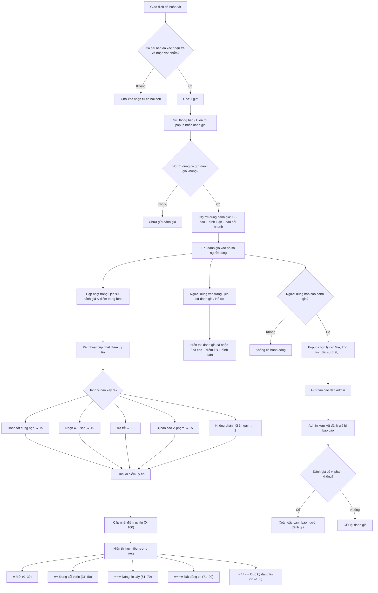

```mermaid
flowchart TD

%% Bắt đầu
A["Giao dịch đã hoàn tất"] --> B{"Cả hai bên đã xác nhận trả và nhận vật phẩm?"}

B -- "Không" --> End1["Chờ xác nhận từ cả hai bên"]
B -- "Có" --> C["Chờ 1 giờ"]

C --> D["Gửi thông báo / Hiển thị popup nhắc đánh giá"]
D --> E{"Người dùng có gửi đánh giá không?"}

E -- "Không" --> End2["Chưa gửi đánh giá"]
E -- "Có" --> F["Người dùng đánh giá: 1-5 sao + bình luận + câu hỏi nhanh"]

F --> G["Lưu đánh giá vào hồ sơ người dùng"]

G --> H["Cập nhật trang Lịch sử đánh giá & điểm trung bình"]

H --> I["Kích hoạt cập nhật điểm uy tín"]

%% Cập nhật điểm uy tín
I --> J{"Hành vi nào xảy ra?"}
J --> J1["Hoàn tất đúng hạn → +5"]
J --> J2["Nhận 4–5 sao → +5"]
J --> J3["Trả trễ → –3"]
J --> J4["Bị báo cáo vi phạm → –5"]
J --> J5["Không phản hồi 3 ngày → –2"]

J1 --> K["Tính lại điểm uy tín"]
J2 --> K
J3 --> K
J4 --> K
J5 --> K

K --> L["Cập nhật điểm uy tín (0–100)"]
L --> M["Hiển thị huy hiệu tương ứng"]
M --> M1["⭐ Mới (0–30)"]
M --> M2["⭐⭐ Đang cải thiện (31–50)"]
M --> M3["⭐⭐⭐ Đáng tin cậy (51–70)"]
M --> M4["⭐⭐⭐⭐ Rất đáng tin (71–90)"]
M --> M5["⭐⭐⭐⭐⭐ Cực kỳ đáng tin (91–100)"]

%% Xem lịch sử đánh giá
G --> N["Người dùng vào trang Lịch sử đánh giá / Hồ sơ"]
N --> O["Hiển thị: đánh giá đã nhận / đã cho + điểm TB + bình luận"]

%% Báo cáo đánh giá sai
G --> P{"Người dùng báo cáo đánh giá?"}
P -- "Không" --> End3["Không có hành động"]
P -- "Có" --> Q["Popup chọn lý do: Giả, Thô tục, Sai sự thật,..."]
Q --> R["Gửi báo cáo đến admin"]

R --> S["Admin xem xét đánh giá bị báo cáo"]
S --> T{"Đánh giá có vi phạm không?"}
T -- "Có" --> U["Xoá hoặc cảnh báo người đánh giá"]
T -- "Không" --> V["Giữ lại đánh giá"]
```
