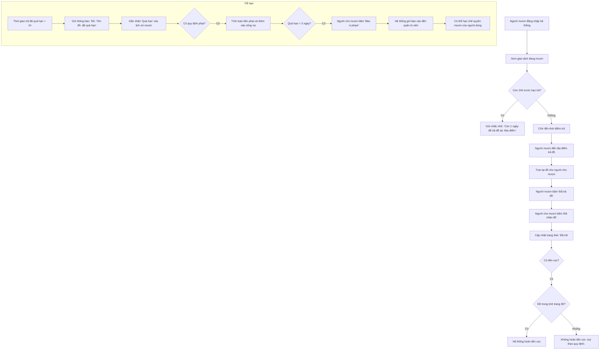

```mermaid
flowchart TD
    A[Người mượn đăng nhập hệ thống] --> B[Xem giao dịch đang mượn]
    B --> C{Còn 24h trước hạn trả?}
    C -- Có --> D[Gửi nhắc nhở: 'Còn 1 ngày để trả đồ tại -Địa điểm-']
    C -- Không --> E[Chờ đến thời điểm trả]

    E --> F[Người mượn đến địa điểm trả đồ]
    F --> G[Trao lại đồ cho người cho mượn]
    G --> H[Người mượn bấm 'Đã trả đồ']
    H --> I[Người cho mượn bấm 'Đã nhận đồ']
    I --> J[Cập nhật trạng thái: 'Đã trả']

    J --> K{Có tiền cọc?}
    K -- Có --> L{Đồ trong tình trạng tốt?}
    L -- Có --> M[Hệ thống hoàn tiền cọc]
    L -- Không --> N[Không hoàn tiền cọc -tuỳ theo quy định-]

    %% Xử lý trễ hạn
    subgraph Trễ hạn
        O[Thời gian trả đã quá hạn > 1h]
        O --> P[Gửi thông báo: 'Đồ -Tên đồ- đã quá hạn']
        P --> Q[Gắn nhãn 'Quá hạn' vào lịch sử mượn]

        Q --> R{Có quy định phạt?}
        R -- Có --> S[Tính toán tiền phạt và thêm vào công nợ]

        S --> T{Quá hạn > 3 ngày?}
        T -- Có --> U[Người cho mượn bấm 'Báo vi phạm']
        U --> V[Hệ thống gửi báo cáo đến quản trị viên]
        V --> W[Có thể hạn chế quyền mượn của người dùng]
    end
```
